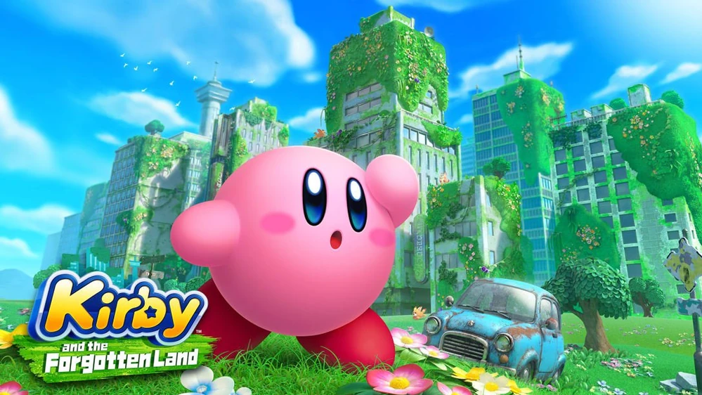

# Kirby-And-The-Forgotten-Land-Archipelago-Manual
This is the Manual for the Nintendo Switch game "Kirby and the Forgotten Land" for usage with the Archipelago software. 

The assumption here is that you already know how to use Manuals and just wanted more information on this Manual. If not, I would suggest starting with Archipelago itself (and eventually join their Discord since most communication happens via Discord). To look at Archipelago for yourself: https://archipelago.gg/

Check the Releases part of this Github to grab the latest version of the Manual. Both the .apworld and the .yaml files can be found there. Do not download the source code. This is to be generated on AP version 0.5.0. 

Any questions or suggestions about this Manual can be directed to the Kirby and the Forgotten Land thread on the AP Manual Discord (preferred), or directly to TailsMK4 on Discord.

Since this is a Manual, you do not need to emulate this game to be able to play this Manual. I would **highly recommend** buying "Kirby and the Forgotten Land" on Switch if you have not already, as it is not only the fastest and easiest way to get started with this Manual, but it looks good for Nintendo as well to keep encouraging HAL to make more Kirby games. Buying the games is the best way to support any franchise, especially for a franchise that tends to not be as popular as other noteworthy franchises by Nintendo.

This Manual is meant to be played on a new save file (though future updates will allow 100% save files to be used as well). The .yaml file already explains the yaml options, but here is a summary:

## goal

Determine what your objective is. The selectable goals are as follows (more to be added in future updates):
- Defeat Meta Knight (Clear the Meta Knight Cup, intended for short multis/playtime)
- Clear Lab Discovera (Defeat Fecto Elfilis, intended for long multis/playtime)
- Clear The Ultimate Cup Z (Defeat Chaos Elfilis at the end of The Ultimate Cup Z, intended for asyncs and long playtime)
- 100 Percent Clear (Complete the game 100%, intended for long playtimes and asyncs that encourage getting all checks, but check with the async creator first)

## randomize_big_rig_mouth

Normally, the "Big-Rig" Mouthful Mode Ability is placed right before the Fecto Elifilis fight since this is the only time in the game this Mouthful Mode Ability is used. This can be disabled to instead place it randomly like the other Mouthful Mode Abilities. If so, this is logically required to do Lab Discovera.

## treasure_roads_include

Enable these if you want to do the various Treasure Roads in the game. This is ideal if you would like Copy Abilities to play more of a role in your path to victory. This is always enabled if you are doing the 100 Percent Clear goal.

## waddle_dee_town_include

Enable these if you want to complete activities in Waddle Dee Town alongside the regular stages. Any activities logically require the Waddle Dees to physically open up the location as well as its location unlock. This is always enabled if you are doing the 100 Percent Clear goal.
